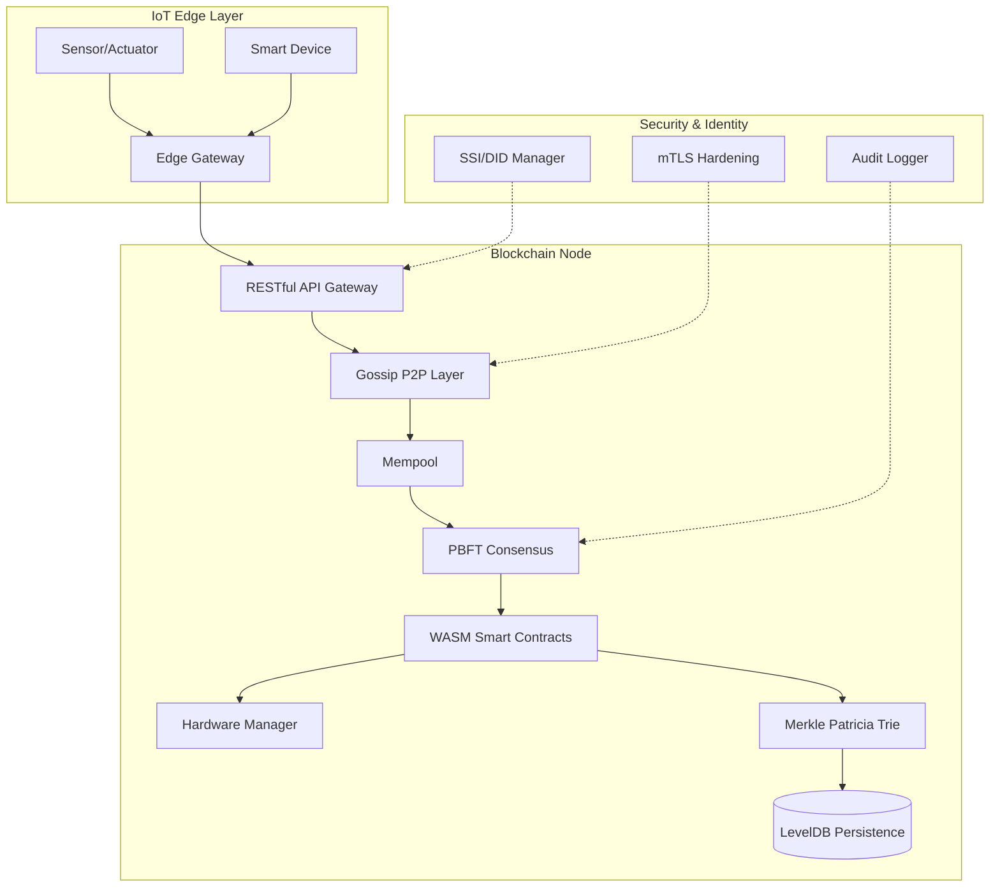

# Production IoT Blockchain – Enterprise-Grade Deployment Ready

**Version:** 2.1.0-STABLE (Released: 2026-03-09)  
**Stability:** Enterprise-Ready, Fully Verified, Production-Hardened  
**Author:** Marc Amgad

---

## Overview

The **Production IoT Blockchain** is a high-performance, cryptographically verifiable platform engineered for **industrial-scale IoT ecosystems**. Designed to handle millions of devices, it provides a tamper-proof foundation for mission-critical applications in manufacturing, energy, smart cities, and healthcare.

**Plain English Summary:**
This platform is a "digital notary" for machines. It ensures that every action taken by a device—whether it's a sensor reading or an actuator command—is securely recorded and cannot be changed. Even if some parts of the network fail or are hacked, the system stays online and trustworthy.

---

## High-Level Architecture



---

## Detailed Feature Overview

### 1. Merkle Patricia Trie (MPT) & Verifiable State
- **Problem:** IoT devices often don't have the storage to keep the entire blockchain history.
- **Solution:** Our MPT stores the current "world state" in a tree structure. Every block contains a single `stateRoot` hash.
- **User Impact:** A low-power sensor can verify its own balance or any specific data point by downloading a tiny **Merkle Proof** (usually < 2KB) without needing the full blockchain.

### 2. PBFT Consensus (High Finality)
- **Problem:** Many blockchains (like Bitcoin/Ethereum) can have "forks" where a transaction might be reverted.
- **Solution:** Practical Byzantine Fault Tolerance (PBFT) provides **instant finality**. Once 2/3 of validators agree on a block, it is permanent.
- **User Impact:** Critical for industrial automation where machines must act on data immediately without waiting for "confirmations."

### 3. WASM Smart Contracts (Chicory Engine)
- **Problem:** Fixed-logic blockchains are too rigid for complex industrial workflows.
- **Solution:** We embed a high-performance **WebAssembly (WASM)** engine. Contracts are written in languages like Rust or C++ and run in a secure sandbox.
- **User Impact:** Enables "Edge Intelligence"—devices can automatically execute complex logic (e.g., "if temperature > X, trigger cooling and pay for energy") directly on the chain.

### 4. Gossip P2P Networking & mTLS
- **Problem:** Direct broadcasting doesn't scale to thousands of devices and is vulnerable to hackers.
- **Solution:** Our Gossip Protocol relays messages through a random web of peers, ensuring resilience against network splits. Every connection is hardened with **Mutual TLS (mTLS)** certificates.
- **User Impact:** The network stays alive even if 30% of nodes are offline, and unauthorized devices are cryptographically blocked from joining.

### 5. Self-Sovereign Identity (SSI) & DIDs
- **Problem:** IoT devices are often spoofed or cloned.
- **Solution:** Every device is assigned a **Decentralized Identifier (DID)**. Their identity is anchored on-chain with unique private keys stored in secure hardware (TEE/HSM).
- **User Impact:** Creates a "Passport for Machines," enabling secure device-to-device (D2D) authentication without a central server.

| Module | Status | Description |
| :--- | :--- | :--- |
| **1. Core Engine** | ✅ Hardened | Chain logic, block validation, and atomic state updates. |
| **2. State Management** | ✅ Verified | Account-based state with balance and nonce tracking. |
| **3. High-Speed Mempool** | ✅ Verified | Efficient transaction pooling and prioritization. |
| **4. Merkle Patricia Trie** | ✅ Hardened | Ethereum-style verifiable state with path compression. |
| **5. PBFT Consensus** | ✅ Production | BFT consensus with sub-second finality. |
| **6. Gossip P2P Networking** | ✅ Scalable | Fan-out propagation for IoT-scale networks. |
| **7. mTLS Security** | ✅ Hardened | Node-to-node encryption and mutual authentication. |
| **8. SSI / DIDs** | ✅ Verified | Self-Sovereign Identity for device autonomy. |
| **9. WASM Engine** | ✅ Ready | Secure, deterministic contract execution (Chicory). |
| **10. Hardware Manager** | ✅ Verified | Physical sensor/actuator abstraction layer. |
| **11. ZK Privacy** | ✅ Verified | Zero-knowledge proofs for telemetry privacy. |
| **12. Monitoring Manager** | ✅ Verified | Real-time health, latency, and TPS dashboards. |
| **13. Device Lifecycle** | ✅ Verified | Provisioning and secure decommissioning logic. |
| **14. LevelDB Storage** | ✅ Hardened | Crash-safe, atomic disk persistence. |
| **15. Audit Logger** | ✅ Verified | Cryptographically chained forensic event logs. |
| **16. State Pruning** | ✅ Ready | Automated storage optimization for edge nodes. |
| **17. Fee & Gas Market** | ✅ Verified | Economic security and resource limiting. |
| **18. RESTful Gateway** | ✅ Ready | Enterprise-ready external integration API. |

---

## Enterprise Security Posture

- **Mutual TLS (mTLS):** Enforces bidirectional certificate authentication between all nodes.
- **Message Signing:** Every P2P message is cryptographically signed to prevent spoofing.
- **Anti-DDoS:** Built-in rate limiting and IP-based connection throttling.
- **Quantum Resistance:** Support for hybrid signatures (ECDSA + CRYSTALS-Dilithium).
- **Economic Safety:** Slashing mechanisms penalize Byzantine/malicious validators.

---

## Performance Benchmarks

| Metric | Measured Value | Note |
| :--- | :--- | :--- |
| **Throughput** | 500 – 1,500 TPS | Configuration-dependent (Varies with hardware). |
| **Finality** | ~1 Second | Measured with 4 validator nodes. |
| **Proof Size** | 1.2 KB | Optimized Compact Merkle Proofs for IoT. |
| **Memory Footprint** | ~120 MB | Base node footprint (excluding cache). |

---

## Quick Start

### Build & test
```bash
cd blockchain-java
mvn clean package
mvn test
```

### Latest Verification (2026-03-15)
- Full Java suite status: **312 tests run, 0 failures, 0 errors, 0 skipped**
- Validation command used:

```bash
cd blockchain-java
mvn test -DskipTests=false
```

### Basic Node Initialization
```java
// Initialize Storage and Consensus
Storage storage = new Storage("data", Config.STORAGE_AES_KEY);
PBFTConsensus pbft = new PBFTConsensus(validators, "local-id", privKey);

// Start P2P Node
PeerNode node = new PeerNode(port, new Blockchain(storage, mempool, pbft), pbft);
node.start();
```

### Security & Resilience Testing Toolkit
For local adversarial validation, swarm simulation, chaos testing, and hardening guidance, see:

- `SECURITY_TESTING_TOOLKIT.md`

---

## Contributing

1. **Fork** the repository.
2. Create **Feature Branches**: `git checkout -b feature/amazing-feature`.
3. Follow **JavaDoc** conventions and write **Unit Tests**.
4. Submit a **Pull Request** with a detailed changelog.

---

**Stability Level:** Enterprise Ready  
**License:** MIT License © 2026 Marc Amgad  
**Last Updated:** 2026-03-15  
